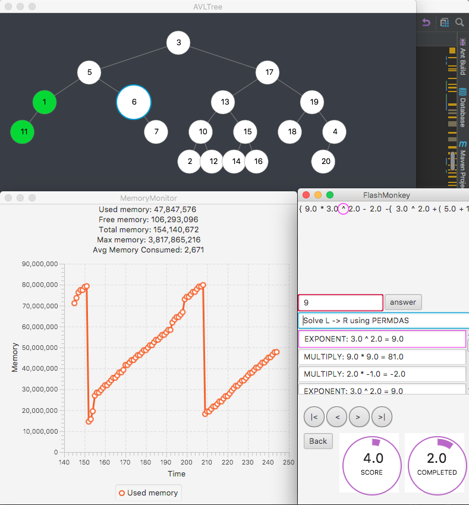

# MemoryMonitor

A Memory Monitor implemented in a JavaFX 8 GUI. Attempts to bias out it's average consumption of memory to get a more accurate understanding of the host applications memory use. 

The image below shows the memory monitor in use with a host application. The memory monitor provides an understanding of the resources consumed, then cleared by the GC. Assists with detecting memory leaks. 

Removing the amount of memory used by the monitor assists with quantifying the amount of memory used by the host application. Test the memory monitor on your host platform for a period of time, then hard code the bias into the monitor to get a more accurate undestanding of memory consumed by the application itself. Although it is not a terribly accurate method, it provides an indicator for potential memory leaks. 

-memory monitor with host application-

